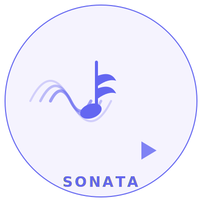

<div align="center">
  
  <h1>🎵 Sonata</h1>
  <p><strong>Lavalink-compatible audio server</strong><br />pure TypeScript · no Java · no yt-dlp</p>
  <p>
    
    
    
    
    
  </p>
  <p>
    <a href="#-features">Features</a> •
    <a href="#-quick-start">Quick Start</a> •
    <a href="#-configuration">Configuration</a> •
    <a href="#-api">API</a> •
    <a href="#-audio-sources">Sources</a> •
    <a href="#-performance">Performance</a>
  </p>
</div>

<br />

> **Sonata** is a drop-in replacement for Lavalink (Java) written entirely in TypeScript. It provides the same REST + WebSocket protocol that Discord bots expect, but with faster startup, lower memory, and native YouTube/SoundCloud/Spotify resolution — no Java runtime or yt-dlp required.

---

## ✨ Features

<table>
  <tr>
    <td>🎧 <strong>Audio Playback</strong></td>
    <td>PCM → Opus encoding, DAVE/E2EE encryption, real-time mixing</td>
  </tr>
  <tr>
    <td>🌐 <strong>12 Audio Sources</strong></td>
    <td>YouTube (InnerTube), Spotify, SoundCloud, Deezer, Apple Music, Bandcamp, Twitch, Vimeo, NicoNico, Mixcloud, Podcasts, HTTP, Local</td>
  </tr>
  <tr>
    <td>🎛️ <strong>13 DSP Filters</strong></td>
    <td>EQ (15-band), karaoke, timescale, tremolo, vibrato, rotation (8D), distortion, channel mix, low-pass, high-pass, reverb, limiter, volume</td>
  </tr>
  <tr>
    <td>📦 <strong>Zero Java</strong></td>
    <td>Pure Node.js — no JRE, no Maven, no yt-dlp</td>
  </tr>
  <tr>
    <td>🔌 <strong>Plugin System</strong></td>
    <td>npm packages, local paths, auto-scan — all with full type support</td>
  </tr>
  <tr>
    <td>🚀 <strong>Performance</strong></td>
    <td>~200ms startup, ~15MB idle, ~30MB with 10 players</td>
  </tr>
  <tr>
    <td>🔄 <strong>Protocol</strong></td>
    <td>Lavalink v4 + v3 — works with any lavaclient</td>
  </tr>
  <tr>
    <td>📊 <strong>Observability</strong></td>
    <td>Prometheus metrics, health check, HTML dashboard</td>
  </tr>
</table>

---

## 🚀 Quick Start

```bash
# clone & install
git clone https://github.com/sonata-sdk/sonata.git
cd sonata
npm install

# configure
cp config.example.js config.js

# build & run
npm run build
node dist/index.js
```

### 🐳 Docker

```bash
docker build -t sonata .
docker run -p 2333:2333 -v ./config.js:/app/config.js sonata
```

### ⚡ Dev mode (no build)

```bash
npx tsx src/index.ts           # one-shot
npm run dev                     # watch mode (auto-restart)
```

---

## ⚙️ Configuration

Copy `config.example.js` → `config.js`. Every option is documented inline.

| Section | Description |
|---------|-------------|
| `server` | Host, port, password, CORS, SSL, dashboard path |
| `logging` | Level, format (text/json), file transport, colors |
| `sources` | Toggle each source on/off, set API keys |
| `lavalink` | API version, session resume, plugin directory |
| `voice` | UDP mode, encryption fallback, keepalive |
| `player` | Volume, idle timeout, normalization, auto-leave |
| `queue` | Max size, history, crossfade, shuffle, loop |
| `cache` | LRU or Redis, TTL, max entries |
| `metrics` | Prometheus endpoint |
| `rateLimiting` | Window, max requests, per-user |
| `security` | HSTS, content-type enforcement, SQLi/XSS blocking |
| `plugins` | npm packages, local paths, per-plugin config |
| `clustering` | Multi-node (coming soon) |
| `resolving` | Search aliases, retry, fallbacks |
| `dashboard` | Theme, refresh, player controls |

---

## 📡 Audio Sources

| Source | Method | Playlists | Auth Required |
|--------|--------|:---------:|:------------:|
|  YouTube | InnerTube API (5 clients) | ✅ | — |
|  SoundCloud | Public API | ✅ | — |
|  Spotify | Web API + YouTube mirror | ✅ | `clientId` + `clientSecret` |
|  Deezer | Gateway API + CDN | ✅ | `arl` |
|  Apple Music | iTunes Search API | ❌ | — |
|  Bandcamp | HTML | ❌ | — |
|  Twitch | HTML | ❌ | — |
|  Vimeo | HTML | ❌ | — |
|  NicoNico | API + HTML | ❌ | — |
|  Mixcloud | API + HTML | ❌ | — |
| Podcast | RSS/XML | ✅ | — |
| 🌐 HTTP | Direct URL | ❌ | — |
| 📁 Local | Filesystem path | ❌ | — |

> **Deezer** requires an `arl` cookie for high-quality streaming. Set `sources.deezer.arl` in config. SOCKS proxy is also supported via `sources.deezer.proxy`.

---

## 📖 API

### Lavalink v4

| Method | Endpoint |
|--------|----------|
| `GET` | `/v4/info` |
| `GET` | `/v4/stats` |
| `GET` / `POST` / `DELETE` | `/v4/sessions`, `/v4/sessions/{id}` |
| `GET` | `/v4/sessions/{id}/players` |
| `GET` / `PATCH` / `DELETE` | `/v4/sessions/{id}/players/{guildId}` |
| `POST` | `/v4/sessions/{id}/players/{guildId}/voice` |
| `GET` | `/v4/loadtracks?identifier=` |
| `GET` / `POST` | `/v4/decodetrack?track=` |
| `POST` | `/v4/decodetracks` |
| `POST` / `DELETE` / `PATCH` | `/v4/sessions/{id}/players/{guildId}/queue` |
| `GET` | `/v4/sessions/{id}/players/{guildId}/history` |
| `GET` | `/v4/routeplanner/status` |
| `POST` | `/v4/routeplanner/free/address`, `/v4/routeplanner/free/all` |

Legacy `/v3/*` endpoints are also available for backward compatibility.

### Extra Endpoints

| Method | Endpoint | Description |
|--------|----------|-------------|
| `GET` | `/health` | Status, uptime, players, memory |
| `GET` | `/version` | Version, node, platform |
| `GET` | `/dashboard` | HTML admin dashboard |
| `GET` | `/metrics` | Prometheus metrics |

### Search Prefixes

| Input | Resolves To |
|-------|-------------|
| `https://youtube.com/watch?v=...` | YouTube |
| `https://open.spotify.com/track/...` | Spotify |
| `https://soundcloud.com/user/track` | SoundCloud |
| `never gonna give you up` | All sources (auto-detect) |
| `ytmixes:VIDEO_ID` | YouTube Mix (recommendations) |
| `ytplaylist:QUERY` | YouTube playlist search |

---

## 🎛️ Audio Filters

| Filter | Description | Range |
|--------|-------------|-------|
| **Volume** | Multiplier with 16-bit clamp | 0% – 1000% |
| **Equalizer** | 15-band graphic EQ (±0.25 gain) | 40Hz – 16kHz |
| **Karaoke** | Center channel removal | — |
| **Timescale** | Speed, pitch, rate | 0.5x – 2.0x |
| **Tremolo** | Amplitude modulation | — |
| **Vibrato** | Pitch modulation | — |
| **Rotation** | 8D stereo pan | 0.05 – 0.5 Hz |
| **Distortion** | Sin/Cos/Tan waveshaping | — |
| **Channel Mix** | Left/right mixing matrix | — |
| **Low Pass** | 1-pole low-pass filter | — |
| **High Pass** | 1-pole high-pass filter | — |
| **Reverb** | Comb-filter delay with decay | 0–100% mix |
| **Limiter** | Dynamic range compression | 0–1 threshold |

Apply via `PATCH /v4/sessions/{id}/players/{guildId}` with `{ filters: { ... } }`.

Example usage:
```json
{
  "filters": {
    "reverb": { "delay": 0.05, "decay": 0.4, "mix": 0.3 },
    "highPass": { "smoothing": 0.1 },
    "limiter": { "threshold": 0.95, "attack": 0.002, "release": 0.1 }
  }
}
```

---

## 🧩 Plugin System

Sonata supports plugins via `config.js`:

```js
plugins: {
  npm: ['@sonata-sdk/plugin-lyrics'],
  paths: ['./my-local-plugin.js'],
  configs: {
    '@sonata-sdk/plugin-lyrics': { geniusApiKey: '...' }
  }
}
```

Create your own using the [**@sonata-sdk/plugin-sdk**](https://github.com/sonata-sdk/sonata-sdk-packages):

```ts
import { register } from '@sonata-sdk/plugin-sdk'

export default register({
  name: 'my-plugin',
  version: '1.0.0',
  install(ctx) {
    ctx.onTrackStart((guildId, track) => {
      ctx.log('info', `▶ ${track.info.title}`)
    })
    ctx.registerRoute('GET', '/my-plugin/status', (req, res) => {
      res.end(JSON.stringify({ ok: true }))
    })
  },
})
```

---

## ⚡ Performance

| Metric | Sonata | Lavalink (Java) |
|--------|:------:|:---------------:|
| Runtime | Node.js 20+ | JRE 17+ |
| Package size | ~5 MB JS | ~100 MB JAR |
| RAM (idle) | ~15 MB | ~300 MB |
| RAM (10 players) | ~30 MB | ~500 MB |
| Startup time | ~200 ms | ~10 s |
| Dependencies | npm | Maven |
| Docker image | ~150 MB | ~400 MB |

---

## 🏗️ Architecture

```
src/
├── index.ts              # Entry point
├── config/               # Config module loader
├── server/               # HTTP + WebSocket server / router / middleware
├── lavalink/             # REST API (v3+v4), WS protocol, session manager
├── player/               # Player state machine, queue, track encoder, audio streamer
├── discord/              # Voice connection (Opus + DAVE/MLS encryption)
├── audio/                # DSP mixer with 13 filters
├── resolving/            # 12 audio source resolvers
│   ├── youtube/          # InnerTube API (5 client profiles)
│   ├── soundcloud/       # SoundCloud public API
│   ├── spotify/          # Spotify Web API + YouTube mirror fallback
│   └── ...               # 9 more sources
├── cache/                # LRU / Redis track cache
├── dashboard/            # HTML admin dashboard
├── metrics/              # Prometheus exporter
├── plugin/               # Plugin manager + loader
└── types/                # TypeScript type definitions
```

~8K lines across 48 files.

---

## 🛠️ Development

```bash
npm run typecheck   # TypeScript type checking
npm test            # Run tests (24 passing)
npm run build       # Compile to dist/
npm run dev         # Watch mode with auto-reload
```

---

## 📦 Related

- [**@sonata-sdk/plugin-sdk**](https://github.com/sonata-sdk/sonata-sdk-packages) — TypeScript SDK for building Sonata plugins
- [**sonata-sdk-packages**](https://github.com/sonata-sdk/sonata-sdk-packages) — Monorepo of official Sonata SDK packages

---

<div align="center">
  <sub>Built with ❤️ in TypeScript · MIT License</sub>
</div>
